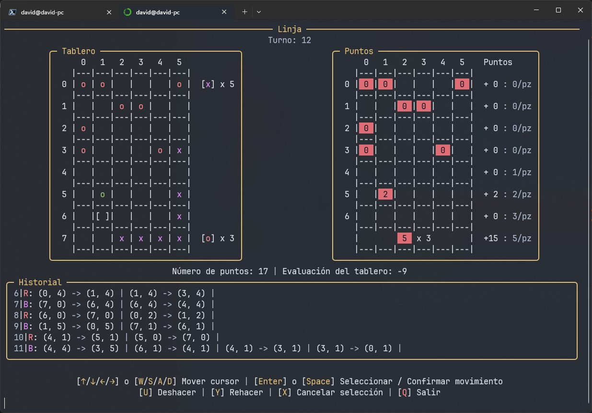
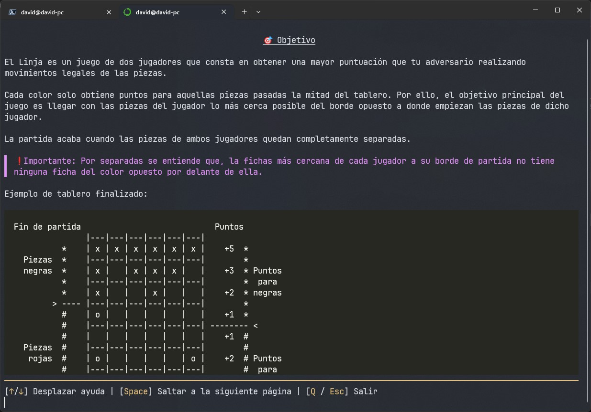

# linja-py

Juego de mesa abstracto para dos jugadores.

## 📋 Índice

- ❔ [¿Qué es?](#-qúe-es)
- ⚡ [Instalación](#-instalación)
- 🧩 [¿Cómo jugar?](#-cómo-jugar)
- 📜 [Licencia](#-licencia)
- 🔧 [Posibles mejoras](#-posibles-mejoras)

## ❔ ¿Qúe es?

El linja es un juego de mesa abstracto para dos jugadores que se basa en obtener el máximo número de puntos posibles moviendo las piezas de cada jugador lo más cerca del borde extremo del contrincante. Una explicación más detallada se puede encontrar [aquí](https://github.com/dtx1007/linja-py/blob/main/markdown/help.md).

Este proyecto fue desarrollado como entrega final para una asignatura de introducción a la Inteligencia Artificial y al uso de modelos y algoritmos relacionados con esta. No se plantea continuar con el proyecto en un futuro proximo puesto que su propósito fue meramente para el aprendizaje, pero, se dan ciertas pautas de cómo podría continuarse y aspectos a mejorar en la sección de 🔧 [Posibles mejoras](#-posibles-mejoras).

El proyecto está hecho en `Python` y el enfoque principal fue implementar un juego de mesa para el cual se pudiera jugar contra el ordenador. El proyecto ofrece las siguientes características:

- Posibilidad de jugar 2 jugadores uno contra otro, además de la posiblidad de jugar contra la máquina (minimax).
- Interfaz de consola personalizada (hecha con [Rich](https://github.com/Textualize/rich)).
- Ayuda incluida dentro del juego.

---

Interfaz del juego:



---

Interfaz de la ayuda:



## ⚡ Instalación

Los requisitos para poder instalar este proyecto son:

- [Git](https://git-scm.com/downloads)
- [Python](https://www.python.org/downloads/) (3.11 o superior)

El primer paso será clonar este repositorio mediante el siguiente comando:

```bash
git clone https://github.com/dtx1007/linja-py
cd linja-py
```

Con el repositorio clonado, lo siguiente que se necesitará es intalar el gestor de dependencias del proyecto, `Poetry`.

```bash
pip install poetry
```

> 📝**Nota:** `Poetry` no es más que una alternativa moderna al clásico `requirements.txt` que se solía emplear en `Python`, `Poetry` es una herramienta que se encarga de simplificar la gestión de dependecias, preparación de entornos reproducibles y el empaquetamiento y compartición de proyectos de `Python`.

Con `Poetry` instalado, se procede a instalar las dependencias y crear el entorno que facilite la ejecución del proyecto, todo esto puede realizarse mediante el siguietne comando:

```bash
poetry install
```

Una vez hecho todo lo anterior, podemos simplemente ejecutar la aplicación con:

```bash
poetry run python -m linja_py
```

## 🧩 ¿Cómo jugar?

Las reglas pueden verse dentro de la ayuda de la aplicación o, en su defecto, se encuentran escritas [aquí](https://github.com/dtx1007/linja-py/blob/main/markdown/help.md).

## 📜 Licencia

Este proyecto se adhiere a los principios de la [Licencia MIT](https://choosealicense.com/licenses/mit/#), garantizando la libertad para usar, modificar y distribuir el software con mínimas restricciones.

## 🔧 Posibles mejoras

- **Traducciones (al inglés u otros idiomas):** reescribir y mover todas las strings de la interfaz a un fichero y poder cambiar entre idiomas desde el menú, eligiendo el archivo de localización correspondiente al idioma seleccionado.
- **Documentar el código:** completar la documentación del código y, posiblemente, traducirla al inglés.
- **Optimizar el algoritmo de cáluclo de movimientos:** actualmente, el código emplea un generador para obtener los posibles movimientos de una posición dada, este proceso podría mejorarse para que fuera más rápido y evitara la generación de movimientos poco útiles.
- **Optimizar el algoritmo de predicción:** en el código se emplea una variante de un algoritmo conocido como minimax, se podrían buscar alternativas a este, optimizarlo o incluso entrenar modelos más avanzados para reemplazarlo.
- **Mejorar el código de la interfaz:** el framework de interfaces usado ([Rich](https://github.com/Textualize/rich)) es muy potente y es muy posible que se pueda mejorar el código creado con este además de poderse añadir otros elementos adicionales a las interfaces o rediseñarlas completamente para ofrecer más estadísticas al jugador y hacerla más simple de entender.
